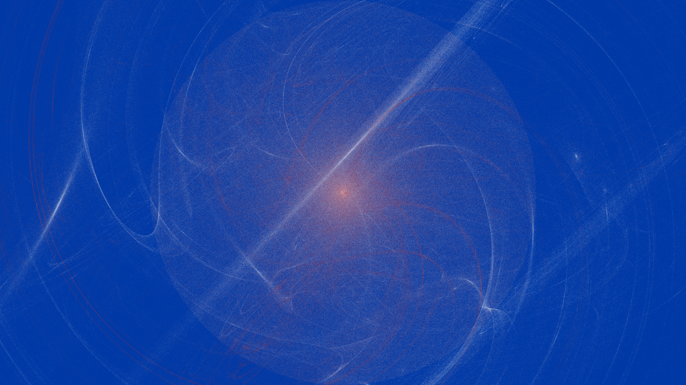
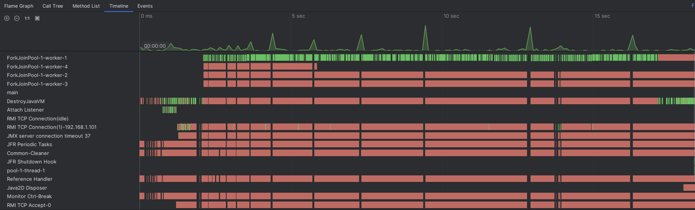
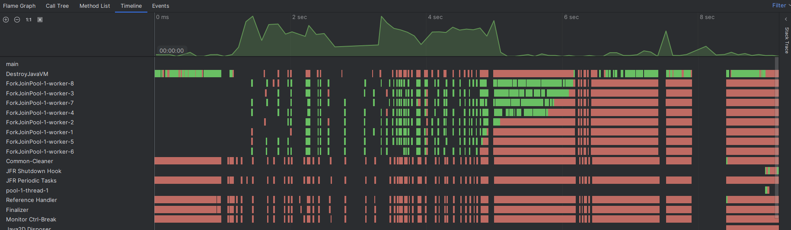

##  Генератор фракталов

Для запуска нужно собрать jar нужно запустить ```mvn package```

Затем в терминале выполнить команду
```java -jar fractal-1.0.0-jar-with-dependencies.jar <аргументы>```

Помощь доступна по параметру ```--h``` или ```--help```

### Примеры фракталов
```java -jar fractal-1.0.0-jar-with-dependencies.jar -p img/test.png```


```java -jar fractal-1.0.0-jar-with-dependencies.jar -p img/test.png -v linear blur spherical swirl -bc #0039A6 -c #FFFFFF #D52B1E -sf 2 ```



```java -jar fractal-1.0.0-jar-with-dependencies.jar  -p img/test.png -nt 8 -v linear blur spherical swirl spiral -sym 2```


### Сравнение производительности при запуске с одним или несколькими потоками
```-p img/test.png -nt 1 -v linear blur spherical swirl spiral -sym 2```


```-p img/test.png -nt 8 -v linear blur spherical swirl spiral -sym 2```

